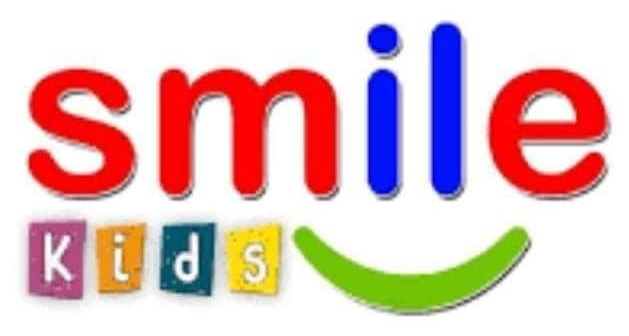

# 🏫 Smile Kids School Management System (SIS)
### مدرسة Smile Kids الخاصة للغات — المنظومة الإلكترونية الموحدة للإدارة المدرسية وشؤون الطلاب (2026 / 2027)



> **منظومة إدارية متكاملة وقاعدة بيانات موحدة تعمل مباشرة على المتصفح بنسبة 100% Client-Side مع مزامنة لحظية بين جميع الصفحات وكشوف الفصول.**

---

## 🌐 روابط المعاينة والتشغيل المباشر (Live Demo)
يمكن تشغيل المنظومة مباشرة عبر **GitHub Pages**:
- 🔗 **البوابة الإلكترونية الموحدة (Portal Landing):** [https://yellanefham.github.io/smile-kids-school-system/](https://yellanefham.github.io/smile-kids-school-system/)
- 📋 **كشوف وقوائم الطلاب والغياب والحضور (1 - 9):** [Student_Roster_Dashboard.html](Student_Roster_Dashboard.html)
- 📅 **الجداول المدرسية الأسبوعية الشاملة:** [Interactive_Timetable_Dashboard.html](Interactive_Timetable_Dashboard.html)
- 🏫 **نظام إدارة المدرسة (درجات، حضور، شهادات):** [Smile_Kids_School_Management_System.html](Smile_Kids_School_Management_System.html)

---

## 🗄️ قاعدة البيانات الموحدة للمدرسة (Master Unified Database)

تم توحيد كافة صفحات ولوحات المدرسة لترتبط بـ **قاعدة بيانات مركزية واحدة**:

| البند | البيان والتفاصيل |
| :--- | :--- |
| **اسم قاعدة البيانات** | **قاعدة بيانات مدرسة Smile Kids الموحدة 2025/2026** |
| **الملف البرمجي الرئيسي** | `smile_kids_database.js` (محرك إدارة البيانات والمزامنة اللحظية) |
| **ملف التصدير والنسخ الاحتياطي** | `smile_kids_database.json` (ملف JSON نظيف لكامل بيانات الـ 131 طالب) |
| **مكان وجود قاعدة البيانات** | في **المجلد الرئيسي للمشروع (Root Directory)** على مستودع GitHub وعلى جهاز الكمبيوتر |
| **مفتاح التخزين الموحد بالمتصفح** | `SMILE_KIDS_MASTER_DATABASE_2026` |
| **آلية المزامنة اللحظية** | **Cross-Tab Real-time Sync** عبر أحداث التخزين المحلية `storage events`، حيث ينعكس أي تعديل على أي اسم أو فصل أو غياب في الصفحة الأولى فوراً داخل الصفحة الثانية المفتوحة بدون الحاجة لإعادة تحميل الصفحة. |

### 🛠️ واجهة برمجة قاعدة البيانات (`window.SmileKidsDB` API):
- `SmileKidsDB.getAllStudents()`: جلب كافة طلاب المدرسة (131 طالب افتراضياً).
- `SmileKidsDB.getStudentsByGrade(grade, track)`: تصفية الطلاب حسب المرحلة (1 إلى 9) وحسب القسم (عربي / لغات).
- `SmileKidsDB.updateStudent(id, patch)`: تحديث أي اسم أو درجة أو قسم، والحفظ التلقائي في قاعدة البيانات المشتركة.
- `SmileKidsDB.addStudent(studentData)`: إضافة طالب جديد وتوليد كود رسمي تلقائياً.
- `SmileKidsDB.deleteStudent(id)`: حذف طالب وتحديث كافة الجداول فوراً.
- `SmileKidsDB.getAttendance(studentId, dateStr)`: جلب حالة حضور الطالب في تاريخ معين.
- `SmileKidsDB.setAttendance(studentId, dateStr, status, note)`: تسجيل الغياب أو الحضور بالتاريخ للطالب.
- `SmileKidsDB.setBatchAttendance(studentIds, dateStr, status)`: تسجيل الحضور الجماعي للفصل بالكامل.
- `SmileKidsDB.downloadJSONBackup()`: تنزيل ملف نسخة احتياطية من قاعدة البيانات بصيغة JSON.
- `SmileKidsDB.importJSON(jsonStr)`: استعادة واستيراد قاعدة بيانات كاملة من ملف خارجي.
- `SmileKidsDB.resetToDefault()`: استعادة قاعدة البيانات الأصلية المعتمدة (131 طالب).
- `SmileKidsDB.subscribe(callback)`: الاستماع الحي لأي تحديث أو تعديل يطرأ على البيانات في أي تبويب.

---

## 🌟 أبرز مميزات النظام

### 1️⃣ نظام رصد الدرجات والتقييمات
- رصد درجات الاختبارات الشهرية (شهر 1، شهر 2) واختبار نهاية الترم الأول والثاني.
- حساب التقديرات والنسب المئوية آلياً (ممتاز، جيد جداً، جيد، مقبول).
- نموذج المعلم الإلكتروني السريع لإدخال درجات الفصل بضغطة زر.
- تصدير شيتات الدرجات الشاملة لكافة المواد والمراحل.

### 2️⃣ كشوف وقوائم الطلاب (الفصول من الصف الأول حتى الصف التاسع)
- استعراض قوائم **131 طالب وطالبة** موزعون على 9 صفوف دراسية (من الصف الأول الابتدائي حتى الثالث الإعدادي).
- **خانة مستقلة لقسم اللغات وقسم العربي**: عند الضغط على اللغات تفتح لغات، وعند الضغط على العربي تفتح عربي، مع إمكانية عرض الكل جنباً إلى جنب.
- **خانة تعديل وتصحيح أسماء وبيانات الطلاب**: لتصحيح أي اسم طالب أو قسم وحفظه فوراً في قاعدة البيانات المشتركة.
- **طباعة الكشوف الرسمية وتصدير ملفات Excel (CSV)**.

### 3️⃣ تسجيل الغياب والحضور والشيت الشهري بالتاريخ
- تسجيل الحضور والغياب اليومي لكل فصل باختيار التاريخ قبل الدخول على الفصل.
- تحديد حالة الطالب بنقرة زر (حاضر، غائب، غياب بعذر).
- **شيت تجميعة غياب الشهر بالكامل لكل فصل موزعاً بالتاريخ يوماً بيوم (1 إلى 31)** مع إجمالي أيام الحضور والغياب ونسب الانضباط.
- طباعة شيت الحضور اليومي والشيت الشهري بالتاريخ بجودة عالية.

### 4️⃣ شهادات التقدير والتفوق الأكاديمي
- توليد شهادات تفوق رسمية ومميزة مع ختم المدرسة الذهبي وتوقيع شؤون الطلاب ومديرة المدرسة.
- دعم اللغتين (عربي لقسم العربي، وإنجليزي لقسم اللغات).
- طباعة شهادة منفردة لكل طالب أو طباعة مجمعة لكافة الأوائل والمتفوقين.

---

## 📊 توزيع الطلاب المعتمد بقاعدة البيانات (131 طالب)

| المرحلة الدراسية | اسم الصف (عربي / إنجليزي) | لغات (Languages) | عربي (Arabic) | الإجمالي |
| :---: | :--- | :---: | :---: | :---: |
| **الصف 1** | الصف الأول الابتدائي (Grade 1) | 10 | 7 | **17** |
| **الصف 2** | الصف الثاني الابتدائي (Grade 2) | 19 | 8 | **27** |
| **الصف 3** | الصف الثالث الابتدائي (Grade 3) | 18 | 5 | **23** |
| **الصف 4** | الصف الرابع الابتدائي (Grade 4) | 13 | 6 | **19** |
| **الصف 5** | الصف الخامس الابتدائي (Grade 5) | 10 | 6 | **16** |
| **الصف 6** | الصف السادس الابتدائي (Grade 6) | 8 | 2 | **10** |
| **الصف 7** | الصف الأول الإعدادي (Grade 7 / Prep 1) | 6 | 4 | **10** |
| **الصف 8** | الصف الثاني الإعدادي (Grade 8 / Prep 2) | 2 | 2 | **4** |
| **الصف 9** | الصف الثالث الإعدادي (Grade 9 / Prep 3) | 2 | 3 | **5** |
| **الإجمالي العام** | **جميع الفصول من 1 حتى 9** | **88 طالب** | **43 طالب** | **131 طالب** |

---

## 📁 هيكلية ملفات المشروع

```text
smile_kids_sis/
│
├── smile_kids_database.js                  # 🗄️ محرك قاعدة البيانات الموحدة والمزامنة اللحظية
├── smile_kids_database.json                # 📄 ملف قاعدة البيانات النظيفة بصيغة JSON
├── index.html                             # 🏠 بوابة النظام الإلكترونية الموحدة
├── Interactive_Timetable_Dashboard.html   # 📅 الجداول المدرسية الأسبوعية الشاملة
├── Smile_Kids_School_Management_System.html# 🏫 لوحة التحكم في الدرجات والحضور والشهادات
├── Student_Roster_Dashboard.html          # 📋 كشوف وقوائم الفصول وتعديل الأسماء والغياب الشهري
├── smile_kids_logo.png                    # 🎨 شعار مدرسة Smile Kids عالي الدقة
└── README.md                              # 📖 دليل التوثيق الشامل
```

---

## 👨‍💻 إعداد وتطوير
- **المدرسة:** مدرسة Smile Kids الخاصة للغات والعربي
- **إشراف وتدقيق:** أ / هيثم عبد الفضيل
- **المنظومة:** إصدار 2026/2027
